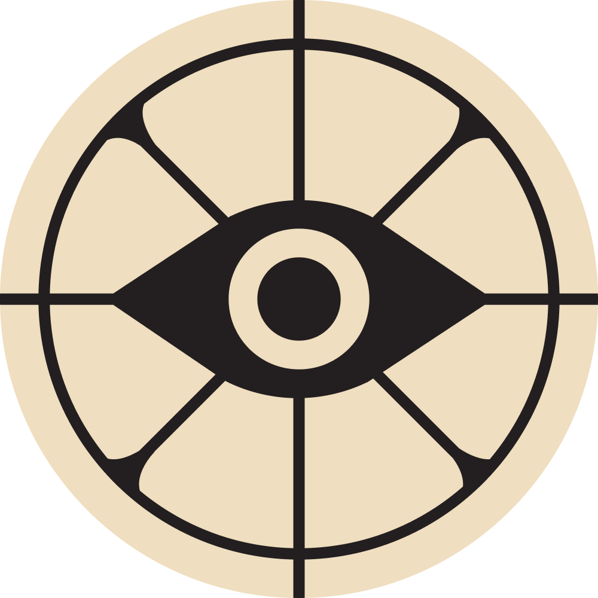

# deadlock-select-screen

The deadlock character selection screen recreated in a browser, using React.

  

# WIP

# Tools used

- Credits to user **"Lovely"** for creating ["Deadlock Graphical Library"](https://forums.playdeadlock.com/resources/deadlock-graphical-library.30/updates) and uploading raw character renders. (Could not contact him because the project's Discord link is broken.)

- [Source2Viewer](https://s2v.app/): For game asset extraction, including music, 3D models, images, etc.

- [pngquant](https://github.com/kornelski/pngquant) & [oxipng](https://github.com/oxipng/oxipng): For image optimization and compression.

- [Blender](https://www.blender.org/download/): To create missing renders of characters (the ones that were not available at "Deadlock Graphical Library").

- **GIMP**: For image editing and manipulation, mainly composing the character renders and backgrounds.

# TO-DO

- Multiple character selection (Roster mode)
- Show info of character abilities
- Improve shadow animation of characters
- Maybe custom skins?
- Add proper optimization for resource loading (tiny thumbnails while full size image loads, preload, load screen maybe, etc.)

# DISCLAIMER

This project is not a playable game nor is intended to be a replacement of the original game, its only purpose is to showcase layout creation in HTML and CSS.
All original assets and characters belong to Valve and their respective owners.
